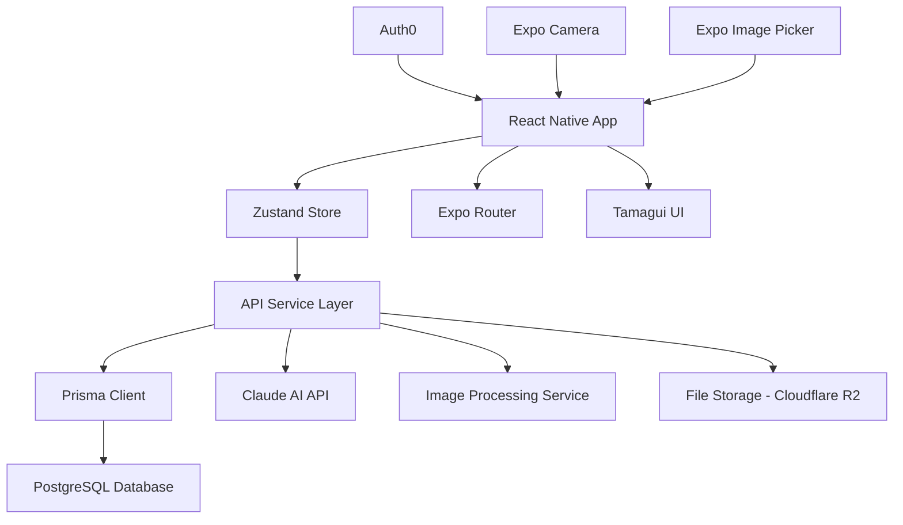

# Design Document

## Overview

Pocket Stylist AIのコア機能実装設計書です。既存の認証システム（Auth0 + Zustand）とデータベース（PostgreSQL + Prisma）を基盤として、ワードローブ管理、AIスタイリング、バーチャル試着機能を実装します。

## Architecture

### システム構成



### レイヤー構成

```
src/
├── components/          # UI コンポーネント
│   ├── wardrobe/       # ワードローブ関連
│   ├── styling/        # スタイリング関連
│   ├── tryon/          # バーチャル試着関連
│   └── common/         # 共通コンポーネント
├── screens/            # 画面コンポーネント
├── services/           # API サービス
├── stores/             # Zustand ストア
├── types/              # TypeScript 型定義
├── utils/              # ユーティリティ
└── hooks/              # カスタムフック
```

## Components and Interfaces

### 1. ワードローブ管理コンポーネント

#### WardrobeScreen
- 服一覧表示
- 検索・フィルタリング機能
- 新規追加ボタン

#### GarmentCard
- 服の情報表示カード
- 画像、名前、カテゴリー表示
- 編集・削除アクション

#### GarmentForm
- 服の登録・編集フォーム
- 画像アップロード機能
- バリデーション付き入力フィールド

#### GarmentDetailModal
- 服の詳細情報表示
- 編集・削除機能
- 試着ボタン

### 2. AIスタイリングコンポーネント

#### StylingScreen
- スタイリング提案画面
- シーン選択機能
- 提案結果表示

#### OutfitSuggestion
- コーディネート提案表示
- 服の組み合わせ表示
- 評価・保存機能

#### StylePreferences
- スタイル設定画面
- 好み・シーン設定
- 体型情報連携

### 3. バーチャル試着コンポーネント

#### TryonScreen
- 試着メイン画面
- カメラ・画像選択
- 結果表示

#### TryonResult
- 試着結果表示
- 保存・共有機能
- フィードバック収集

### 4. プロフィール管理コンポーネント

#### BodyProfileForm
- 体型情報入力フォーム
- 測定値入力
- 体型タイプ選択

#### PreferencesForm
- 好み設定フォーム
- スタイル・色・ブランド選択
- 価格帯設定

## Data Models

### 既存モデル拡張

#### User Model (既存)
```typescript
interface User {
  id: string
  email: string
  name?: string
  auth0Id: string
  avatarUrl?: string
  gender?: Gender
  birthDate?: Date
  phone?: string
  preferences?: UserPreferences
  createdAt: Date
  updatedAt: Date
}
```

#### UserPreferences Type
```typescript
interface UserPreferences {
  styles: string[]           // preferred styles
  colors: string[]          // preferred colors
  brands: string[]          // preferred brands
  priceRange: {
    min: number
    max: number
  }
  occasions: string[]       // work, casual, formal, etc.
  avoidColors: string[]     // colors to avoid
  fitPreference: 'loose' | 'fitted' | 'regular'
}
```

### 新規フロントエンド型定義

#### GarmentFormData
```typescript
interface GarmentFormData {
  name: string
  category: string
  subcategory?: string
  brand?: string
  color?: string
  size?: string
  material?: string
  price?: number
  tags?: string[]
  condition?: Condition
  image?: ImagePickerAsset
}
```

#### OutfitSuggestionData
```typescript
interface OutfitSuggestionData {
  id: string
  garments: Garment[]
  occasion?: string
  season?: Season
  weather?: string
  aiDescription?: string
  confidenceScore: number
  reasoning: string
}
```

#### TryonSessionData
```typescript
interface TryonSessionData {
  sessionId: string
  bodyImage?: string
  selectedGarments: string[]
  results: TryonResultData[]
}

interface TryonResultData {
  resultImageUrl: string
  fitAnalysis: {
    overall: number
    fit: number
    style: number
    color: number
  }
  recommendations: string[]
}
```

## Services Architecture

### 1. GarmentService
```typescript
class GarmentService {
  async createGarment(data: GarmentFormData): Promise<Garment>
  async updateGarment(id: string, data: Partial<GarmentFormData>): Promise<Garment>
  async deleteGarment(id: string): Promise<void>
  async getUserGarments(userId: string, filters?: GarmentFilters): Promise<Garment[]>
  async uploadGarmentImage(file: ImagePickerAsset): Promise<string>
}
```

### 2. StylingService
```typescript
class StylingService {
  async generateOutfitSuggestions(
    userId: string,
    preferences: StylingPreferences
  ): Promise<OutfitSuggestionData[]>

  async saveOutfit(userId: string, outfit: OutfitData): Promise<Outfit>
  async rateOutfit(outfitId: string, rating: number): Promise<void>
  async getUserOutfits(userId: string): Promise<Outfit[]>
}
```

### 3. TryonService
```typescript
class TryonService {
  async startTryonSession(userId: string, bodyImage: string): Promise<string>
  async addGarmentToTryon(sessionId: string, garmentId: string): Promise<TryonResultData>
  async saveTryonResult(sessionId: string, rating: number): Promise<void>
  async getTryonHistory(userId: string): Promise<Tryon[]>
}
```

### 4. AIService
```typescript
class AIService {
  async analyzeGarment(imageUrl: string): Promise<GarmentAnalysis>
  async generateStylingAdvice(
    garments: Garment[],
    userProfile: BodyProfile,
    occasion: string
  ): Promise<StylingAdvice>

  async processVirtualTryon(
    bodyImage: string,
    garmentImages: string[]
  ): Promise<TryonResult>
}
```

## State Management

### Zustand Stores

#### WardrobeStore
```typescript
interface WardrobeStore {
  garments: Garment[]
  loading: boolean
  filters: GarmentFilters

  // Actions
  fetchGarments: () => Promise<void>
  addGarment: (garment: GarmentFormData) => Promise<void>
  updateGarment: (id: string, data: Partial<GarmentFormData>) => Promise<void>
  deleteGarment: (id: string) => Promise<void>
  setFilters: (filters: GarmentFilters) => void
  clearFilters: () => void
}
```

#### StylingStore
```typescript
interface StylingStore {
  suggestions: OutfitSuggestionData[]
  savedOutfits: Outfit[]
  loading: boolean

  // Actions
  generateSuggestions: (preferences: StylingPreferences) => Promise<void>
  saveOutfit: (outfit: OutfitData) => Promise<void>
  rateOutfit: (outfitId: string, rating: number) => Promise<void>
  fetchSavedOutfits: () => Promise<void>
}
```

#### TryonStore
```typescript
interface TryonStore {
  currentSession?: TryonSessionData
  history: Tryon[]
  loading: boolean

  // Actions
  startSession: (bodyImage: string) => Promise<void>
  addGarmentToSession: (garmentId: string) => Promise<void>
  saveSession: (rating: number) => Promise<void>
  fetchHistory: () => Promise<void>
  clearSession: () => void
}
```

## Error Handling

### エラー分類
1. **Network Errors** - API通信エラー
2. **Validation Errors** - 入力値検証エラー
3. **Authentication Errors** - 認証エラー
4. **File Upload Errors** - 画像アップロードエラー
5. **AI Service Errors** - AI API エラー

### エラーハンドリング戦略
```typescript
interface AppError {
  code: string
  message: string
  details?: any
  timestamp: Date
}

class ErrorHandler {
  static handle(error: unknown): AppError
  static showUserFriendlyMessage(error: AppError): void
  static logError(error: AppError): void
}
```

### ユーザー向けエラーメッセージ
- ネットワークエラー: "インターネット接続を確認してください"
- 画像アップロードエラー: "画像のアップロードに失敗しました。もう一度お試しください"
- AI処理エラー: "AI分析中にエラーが発生しました。しばらく待ってから再試行してください"

## Testing Strategy

### 1. Unit Tests
- Service層のロジックテスト
- Zustand storeのテスト
- ユーティリティ関数のテスト

### 2. Component Tests
- React Native Testing Libraryを使用
- ユーザーインタラクションのテスト
- 状態変更のテスト

### 3. Integration Tests
- API統合テスト
- 画像アップロード機能テスト
- 認証フローテスト

### 4. E2E Tests (将来実装)
- Detoxを使用したE2Eテスト
- 主要ユーザーフローのテスト

## Performance Considerations

### 1. 画像最適化
- 画像圧縮・リサイズ
- 遅延読み込み
- キャッシュ戦略

### 2. データ取得最適化
- ページネーション実装
- 無限スクロール
- データキャッシュ

### 3. AI処理最適化
- バックグラウンド処理
- 結果キャッシュ
- プログレス表示

## Security Considerations

### 1. 画像セキュリティ
- アップロード時のファイル検証
- 画像メタデータ削除
- セキュアなURL生成

### 2. データプライバシー
- 個人情報の暗号化
- 体型データの適切な管理
- GDPR準拠

### 3. API セキュリティ
- 認証トークンの適切な管理
- レート制限
- 入力値検証
