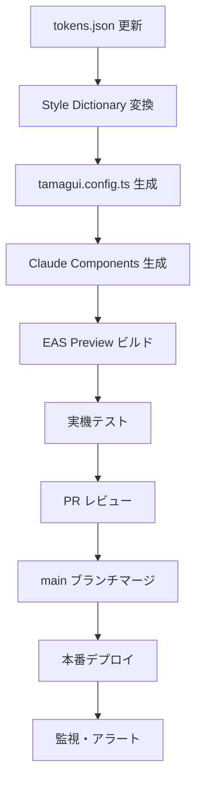

# AI Pipeline

## 概要

Pocket Stylist AI では、AI を活用した自動化パイプラインを構築し、デザイントークンからコンポーネント生成、テストデプロイまでを自動化します。このパイプラインにより、一貫性のあるデザインシステムと高品質なコンポーネントを効率的に提供できます。

## 1. tokens.json 自動変換 (Style Dictionary)

### 概要
OSS のデザイントークンを取得し、Pocket Stylist AI のブランドカラー（#E14F5A）に自動変換。Style Dictionary を使用して、Tamagui 用のテーマファイルと NativeWind 用のプリセットファイルを生成します。

### GitHub Actions ファイル
**`.github/workflows/tokens.yml`**

### 実行内容
- OSS tokens.json の取得
- Primary カラーの一括置換（#E14F5A）
- Style Dictionary による変換処理
- `tamagui.config.ts` の生成
- `tailwind.preset.js` の生成
- 自動コミット & PR 作成

### 主要ステップ
1. **トークン取得**: 外部 OSS リポジトリから tokens.json をダウンロード
2. **カラー変換**: プライマリーカラーを #E14F5A に自動置換
3. **Tamagui 変換**: Style Dictionary で tamagui.config.ts を生成
4. **NativeWind 変換**: tailwind.preset.js を生成
5. **ファイル出力**: 生成されたファイルを適切なディレクトリに配置
6. **コミット**: 変更をコミットし、PR を自動作成

### 設定ファイル
```javascript
// style-dictionary.config.js
module.exports = {
  source: ['tokens/**/*.json'],
  platforms: {
    tamagui: {
      transformGroup: 'tamagui',
      buildPath: 'src/theme/',
      files: [{
        destination: 'tamagui.config.ts',
        format: 'typescript/es6'
      }]
    },
    nativewind: {
      transformGroup: 'css',
      buildPath: 'src/styles/',
      files: [{
        destination: 'tailwind.preset.js',
        format: 'javascript/es6'
      }]
    }
  }
};
```

## 2. Claude Components Action

### 概要
Claude API を使用してコンポーネントを自動生成。プロンプトテンプレートに基づいて、統一されたコーディング規約とデザインシステムに従った React Native コンポーネントを生成します。

### GitHub Actions ファイル
**`.github/workflows/claude-components.yml`**

### 実行内容
- プロンプトテンプレートの読み込み
- Claude API 呼び出し
- コンポーネントコード生成
- TypeScript 型チェック
- Biome によるフォーマット
- PR 作成

### 主要ステップ
1. **プロンプト読み込み**: `prompts/ui_components.md` からテンプレートを読み込み
2. **Claude API 呼び出し**: 指定されたコンポーネントの生成リクエスト
3. **コード生成**: PSButton.tsx、GarmentCard.tsx 等の生成
4. **品質チェック**: TypeScript コンパイルとリンティング
5. **ファイル出力**: `components/` ディレクトリに配置
6. **PR 作成**: 生成されたコンポーネントの PR を作成

### プロンプトテンプレート例
```markdown
# UI Component Generation Prompt

## Context
- Project: Pocket Stylist AI
- Framework: React Native + Tamagui
- Styling: NativeWind
- TypeScript: Strict mode

## Requirements
- Follow existing design system
- Include proper TypeScript types
- Add accessibility features
- Include unit tests
- Follow coding conventions

## Generate: PSButton Component
[詳細なプロンプト内容]
```

## 3. Expo EAS Preview

### 概要
Expo EAS を使用してプレビュー版を自動ビルド。QR コードによる実機テストを可能にし、チーム全体でのレビューを効率化します。

### GitHub Actions ファイル
**`.github/workflows/expo-preview.yml`**

### 実行内容
- Expo プロジェクトのビルド
- EAS Preview の生成
- QR コード付きプレビュー URL の生成
- Slack 通知
- TestFlight/Internal Testing への配信

### 主要ステップ
1. **環境準備**: Node.js、Expo CLI のセットアップ
2. **依存関係インストール**: `bun install` による高速インストール
3. **型チェック**: `tsgo` による TypeScript 型チェック
4. **リンティング**: Biome によるコード品質チェック
5. **テスト実行**: Jest による自動テスト実行
6. **EAS ビルド**: Expo EAS でプレビュー版をビルド
7. **配信**: TestFlight/Google Play Internal Testing への配信
8. **通知**: Slack チャンネルへの完了通知

### EAS 設定
```json
// eas.json
{
  "cli": {
    "version": ">= 3.0.0"
  },
  "build": {
    "preview": {
      "distribution": "internal",
      "ios": {
        "resourceClass": "m1-medium"
      },
      "android": {
        "buildType": "apk"
      }
    }
  },
  "submit": {
    "preview": {
      "ios": {
        "appleId": "your-apple-id",
        "ascAppId": "your-app-id"
      },
      "android": {
        "serviceAccountKeyPath": "path/to/service-account.json",
        "track": "internal"
      }
    }
  }
}
```

## 4. PR Merge → 実機確認

### 概要
PR マージ後の自動デプロイメントと実機での動作確認プロセス。本番環境への安全なデプロイを実現します。

### GitHub Actions ファイル
**`.github/workflows/deploy-production.yml`**

### 実行内容
- PR マージトリガー
- 本番ビルド
- 自動テスト実行
- App Store/Play Store への配信
- 実機テスト環境の更新

### 主要ステップ
1. **マージ検知**: main ブランチへの PR マージを検知
2. **品質チェック**: 全テストスイートの実行
3. **セキュリティチェック**: 依存関係の脆弱性スキャン
4. **本番ビルド**: 本番環境用の最適化ビルド
5. **配信準備**: App Store Connect/Google Play Console への配信
6. **段階的ロールアウト**: 段階的なユーザー配信
7. **監視開始**: Sentry でのエラー監視開始
8. **チーム通知**: 配信完了の Slack 通知

### 品質ゲート
- **TypeScript**: 型エラー 0 件
- **Biome**: リンティングエラー 0 件
- **Jest**: テストカバレッジ 80% 以上
- **E2E**: 主要フローの自動テスト通過
- **Performance**: Lighthouse スコア 90 点以上

### 監視とアラート
- **Sentry**: リアルタイムエラー追跡
- **PostHog**: ユーザー行動分析
- **Cloudflare Analytics**: パフォーマンス監視
- **Custom Metrics**: ビジネス指標の追跡

## ワークフロー連携

### 全体フロー


### 自動化レベル
- **Level 1**: 手動トリガー（初期導入）
- **Level 2**: スケジュール実行（定期更新）
- **Level 3**: イベント駆動（完全自動化）
- **Level 4**: 機械学習による最適化

## 設定・管理

### 環境変数
```bash
# Claude API
CLAUDE_API_KEY=your_claude_api_key
CLAUDE_MODEL=claude-3-sonnet-20240229

# Expo EAS
EXPO_TOKEN=your_expo_token

# App Store/Play Store
APP_STORE_CONNECT_KEY=your_app_store_key
GOOGLE_PLAY_SERVICE_ACCOUNT=your_service_account

# Slack
SLACK_WEBHOOK_URL=your_slack_webhook_url
```

### セキュリティ
- シークレット管理: GitHub Secrets
- API キーローテーション: 定期的な自動更新
- アクセス制御: 最小権限の原則
- 監査ログ: 全アクションの記録

このパイプラインにより、デザイン変更からコンポーネント生成、実機テストまでの一連の流れを自動化し、高品質なモバイルアプリケーションの継続的な改善を実現します。