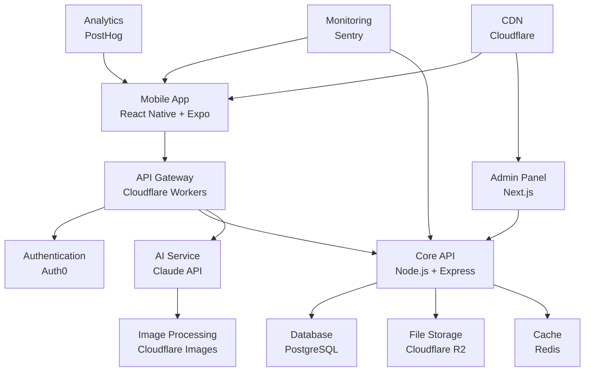
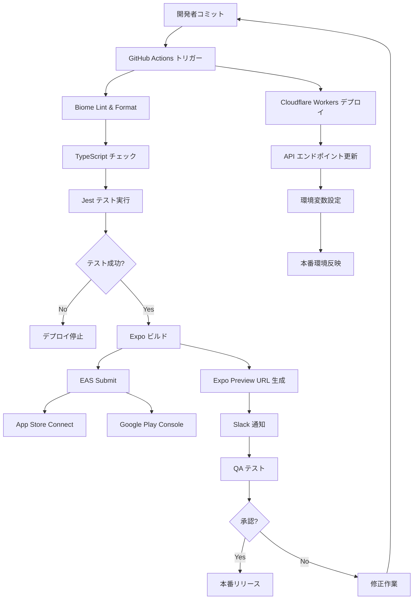

# Architecture

## システム構成図

## 技術スタック

| レイヤー | 技術 | 理由 |
|---|---|---|
| **Frontend** | React Native + Expo | クロスプラットフォーム開発、高速プロトタイピング |
| **UI Framework** | Tamagui | パフォーマンス最適化、統一されたデザインシステム |
| **Styling** | NativeWind | Tailwind CSS の React Native 実装、開発効率 |
| **State Management** | Zustand | 軽量でシンプルな状態管理、TypeScript サポート |
| **API Gateway** | Cloudflare Workers | エッジコンピューティング、低レイテンシー |
| **Backend** | Node.js + Express | JavaScript エコシステム統一、豊富なライブラリ |
| **Database** | PostgreSQL | ACID 準拠、複雑なクエリ対応、拡張性 |
| **AI Service** | Claude API | 高精度な自然言語処理、ファッション分析 |
| **Authentication** | Auth0 | セキュアな認証、SNS ログイン対応 |
| **File Storage** | Cloudflare R2 | S3 互換、低コスト、高可用性 |
| **Cache** | Redis | 高速データアクセス、セッション管理 |
| **Image Processing** | Cloudflare Images | 自動最適化、複数フォーマット対応 |
| **Analytics** | PostHog | イベント追跡、ユーザー行動分析 |
| **Monitoring** | Sentry | エラー追跡、パフォーマンス監視 |
| **CDN** | Cloudflare | 高速コンテンツ配信、DDoS 対策 |
| **CI/CD** | GitHub Actions | 自動化されたビルド・テスト・デプロイ |
| **Package Manager** | Bun | 高速パッケージ管理、Node.js 互換性 |
| **Linting** | Biome | 高速リンティング・フォーマット、Rust 製 |
| **Type Checking** | tsc | TypeScript 公式コンパイラ |

## デプロイフロー

