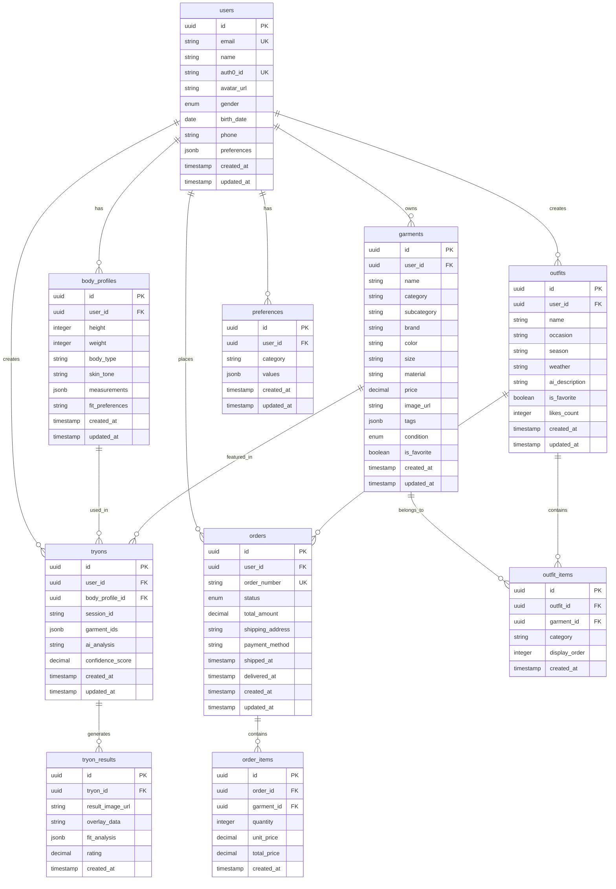

# Data Models

## ER図

## テーブル詳細

### users

| Column | Type | Description |
|---|---|---|
| id | UUID | プライマリーキー |
| email | VARCHAR(255) | ユーザーのメールアドレス（一意） |
| name | VARCHAR(100) | ユーザーの表示名 |
| auth0_id | VARCHAR(255) | Auth0 ユーザーID（一意） |
| avatar_url | TEXT | プロフィール画像のURL |
| gender | ENUM | 性別（male, female, other） |
| birth_date | DATE | 生年月日 |
| phone | VARCHAR(20) | 電話番号 |
| preferences | JSONB | ユーザー設定とプリファレンス |
| created_at | TIMESTAMP | 作成日時 |
| updated_at | TIMESTAMP | 更新日時 |

### body_profiles

| Column | Type | Description |
|---|---|---|
| id | UUID | プライマリーキー |
| user_id | UUID | ユーザーID（外部キー） |
| height | INTEGER | 身長（cm） |
| weight | INTEGER | 体重（kg） |
| body_type | VARCHAR(50) | 体型分類（pear, apple, hourglass, etc.） |
| skin_tone | VARCHAR(50) | 肌色分類（warm, cool, neutral） |
| measurements | JSONB | 詳細な身体測定データ |
| fit_preferences | VARCHAR(100) | フィット感の好み |
| created_at | TIMESTAMP | 作成日時 |
| updated_at | TIMESTAMP | 更新日時 |

### garments

| Column | Type | Description |
|---|---|---|
| id | UUID | プライマリーキー |
| user_id | UUID | ユーザーID（外部キー） |
| name | VARCHAR(200) | 商品名 |
| category | VARCHAR(50) | カテゴリー（tops, bottoms, shoes, etc.） |
| subcategory | VARCHAR(50) | サブカテゴリー（shirt, dress, jeans, etc.） |
| brand | VARCHAR(100) | ブランド名 |
| color | VARCHAR(50) | 色 |
| size | VARCHAR(20) | サイズ |
| material | VARCHAR(100) | 素材 |
| price | DECIMAL(10,2) | 価格 |
| image_url | TEXT | 商品画像のURL |
| tags | JSONB | 商品タグ（casual, formal, vintage, etc.） |
| condition | ENUM | 状態（new, like_new, good, fair） |
| is_favorite | BOOLEAN | お気に入り登録フラグ |
| created_at | TIMESTAMP | 作成日時 |
| updated_at | TIMESTAMP | 更新日時 |

### tryons

| Column | Type | Description |
|---|---|---|
| id | UUID | プライマリーキー |
| user_id | UUID | ユーザーID（外部キー） |
| body_profile_id | UUID | ボディプロファイルID（外部キー） |
| session_id | VARCHAR(100) | セッション識別子 |
| garment_ids | JSONB | 試着対象の衣服ID配列 |
| ai_analysis | TEXT | AIによる分析結果 |
| confidence_score | DECIMAL(3,2) | 信頼度スコア（0.00-1.00） |
| created_at | TIMESTAMP | 作成日時 |
| updated_at | TIMESTAMP | 更新日時 |

### tryon_results

| Column | Type | Description |
|---|---|---|
| id | UUID | プライマリーキー |
| tryon_id | UUID | 試着ID（外部キー） |
| result_image_url | TEXT | 結果画像のURL |
| overlay_data | TEXT | オーバーレイデータ |
| fit_analysis | JSONB | フィット分析結果 |
| rating | DECIMAL(2,1) | ユーザー評価（1.0-5.0） |
| created_at | TIMESTAMP | 作成日時 |

### outfits

| Column | Type | Description |
|---|---|---|
| id | UUID | プライマリーキー |
| user_id | UUID | ユーザーID（外部キー） |
| name | VARCHAR(200) | コーディネート名 |
| occasion | VARCHAR(50) | 着用シーン（work, casual, party, etc.） |
| season | VARCHAR(20) | 季節（spring, summer, fall, winter） |
| weather | VARCHAR(50) | 天気条件 |
| ai_description | TEXT | AIによる説明 |
| is_favorite | BOOLEAN | お気に入り登録フラグ |
| likes_count | INTEGER | いいね数 |
| created_at | TIMESTAMP | 作成日時 |
| updated_at | TIMESTAMP | 更新日時 |

### outfit_items

| Column | Type | Description |
|---|---|---|
| id | UUID | プライマリーキー |
| outfit_id | UUID | コーディネートID（外部キー） |
| garment_id | UUID | 衣服ID（外部キー） |
| category | VARCHAR(50) | アイテムカテゴリー |
| display_order | INTEGER | 表示順序 |
| created_at | TIMESTAMP | 作成日時 |

### orders

| Column | Type | Description |
|---|---|---|
| id | UUID | プライマリーキー |
| user_id | UUID | ユーザーID（外部キー） |
| order_number | VARCHAR(50) | 注文番号（一意） |
| status | ENUM | 注文状態（pending, confirmed, shipped, delivered, cancelled） |
| total_amount | DECIMAL(10,2) | 合計金額 |
| shipping_address | TEXT | 配送先住所 |
| payment_method | VARCHAR(50) | 支払い方法 |
| shipped_at | TIMESTAMP | 発送日時 |
| delivered_at | TIMESTAMP | 配達日時 |
| created_at | TIMESTAMP | 作成日時 |
| updated_at | TIMESTAMP | 更新日時 |

### order_items

| Column | Type | Description |
|---|---|---|
| id | UUID | プライマリーキー |
| order_id | UUID | 注文ID（外部キー） |
| garment_id | UUID | 衣服ID（外部キー） |
| quantity | INTEGER | 数量 |
| unit_price | DECIMAL(10,2) | 単価 |
| total_price | DECIMAL(10,2) | 合計価格 |
| created_at | TIMESTAMP | 作成日時 |

### preferences

| Column | Type | Description |
|---|---|---|
| id | UUID | プライマリーキー |
| user_id | UUID | ユーザーID（外部キー） |
| category | VARCHAR(50) | 設定カテゴリー（style, color, brand, etc.） |
| values | JSONB | 設定値 |
| created_at | TIMESTAMP | 作成日時 |
| updated_at | TIMESTAMP | 更新日時 |